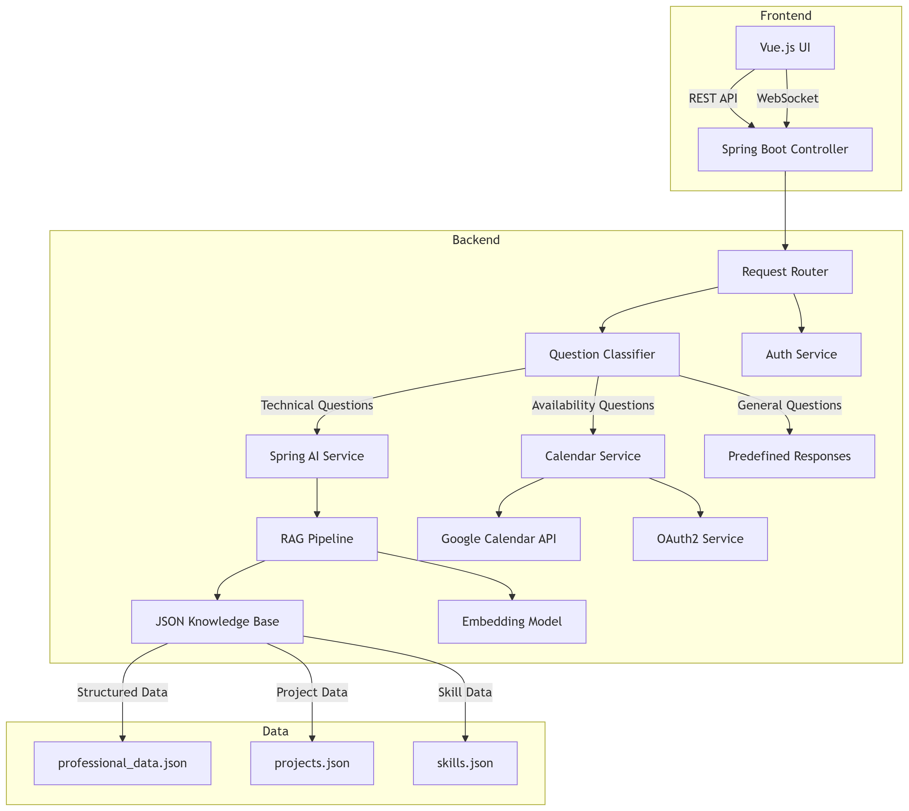

# Portfolio Virtual Assistant with Spring AI

## 🎬 Video Demo

[](https://www.youtube.com/watch?v=SYsIUk8VgYk)

▶️ [Watch full demo on YouTube](https://www.youtube.com/watch?v=SYsIUk8VgYk)
A smart virtual assistant integrated into my professional portfolio that handles recruiter inquiries using Spring AI, RAG, and Google Calendar integration.

## 🚀 Features

- **Automated Recruiter Responses**: Answers common questions about my experience, skills, and availability
- **RAG Implementation**: Uses Retrieval-Augmented Generation with embedded JSON knowledge base
- **Meeting Scheduling**: Direct Google Calendar integration for booking appointments
- **Markdown Support**: Rich formatting in responses
- **Context Boundary**: Professional-only responses with sensitive question filtering

## � The Problem It Solves

Recruiters often ask repetitive questions despite information being available in my:
- LinkedIn profile
- Resume/CV
- Portfolio website

This assistant provides instant, accurate answers to:
- Technology experience questions ("How many years with Spring Boot?")
- Project inquiries ("Which projects used Java?")
- Availability status ("Are you open for opportunities?")
- Salary range expectations
- Meeting scheduling requests

## 🛠️ Technology Stack

| Component            | Technology                  |
|----------------------|-----------------------------|
| Backend              | Spring Boot 3.5.3, Java 24  |
| Frontend             | Vue.js 3, Tailwind css      |
| AI Integration       | Spring AI with LLM model    |
| Knowledge Base       | Raw JSON + RAG (Embeddings) |
| Calendar Integration | Google Calendar API         |
| Deployment           | Docker                      |

## 📐 Architecture



## 📦Running the Project with Docker
   ```bash
      docker-compose up --build -d
   ```
